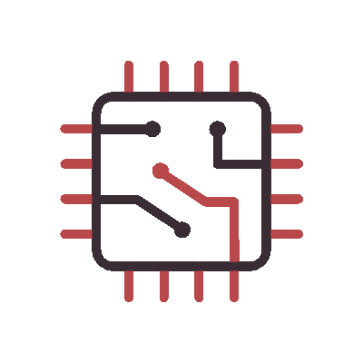

<!--h1 without bottom border-->

        <ul align="left">
                

                        <h1>
                                <b>I'm Buddika Kasun</b>
                                 
                        </h1>
                

        </ul>

        

        
        

        <!--  &nbsp; -->
         &nbsp;
        

<!--h1 without bottom border-->

        <ul align="left">
                

                        <h1>
                                Skills
                                
                        </h1>
                

        </ul>

<!--horizontal divider(gradiant)-->
<!--  -->

        <ul align="left">
                

                        <h1>
                                GitHub Analytics
                                
                        </h1>
                

        </ul>

        

        
        <!---->

        
        <a href="https://github.com/issues?q=is%3Aissue+author%3ABuddika-Kasun+archived%3Afalse+is%3Aclosed#gh-dark-mode-only">
                <a>

	<picture>
		  <source media="(prefers-color-scheme: dark)" srcset="https://raw.githubusercontent.com/Buddika-Kasun/Buddika-Kasun/output/github-contribution-grid-snake-dark.svg">
		  <source media="(prefers-color-scheme: light)" srcset="https://raw.githubusercontent.com/Buddika-Kasun/Buddika-Kasun/output/github-contribution-grid-snake.svg">
		  
	</picture>

<!-- Connect with me -->
<!--h2 without bottom border-->

        <ul align="center">
                

                        <h2>Connect With Me🤝</h2>
                

        </ul>

<!--icons and links-->

        
        
        
        

<!--profile visit count-->

        

