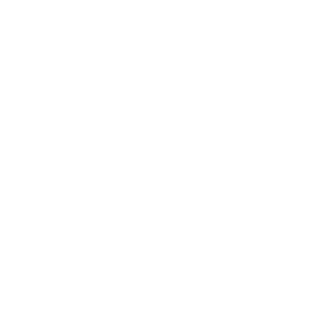

<!-- Name Header -->
<!-- h1 without bottom border -->

        <ul align="left">
                

                        <h1>
                                Hi, I'm <b>Buddika Kasun</b>
                                
                        </h1>
                

        </ul>

<!-- Header Banner -->

        <!--
-->
	
        
	
        <!--
-->

<!-- Right Side Coding Gif -->

<!-- Left Side Typing Gif -->

<!-- Skills Header -->

        <ul align="left">
                

                        <h1>
                                Skills
                                
                        </h1>
                

        </ul>

<!-- Skill Icons -->

<!--horizontal divider(gradiant)-->
<!--  -->

<!-- Rigth Side Graph Gif -->

<!-- Github Analytics Header -->

        <ul align="left">
                

                        <h1>
                                GitHub Analytics
                                
                        </h1>
                

        </ul>

<!-- Left Side Stat Graph -->

<!-- Right Side Stat Graph -->

        <!-- Contribution Graph -->
        
        <!-- Contribution Snake -->
	<picture>
		  <source media="(prefers-color-scheme: dark)" srcset="https://raw.githubusercontent.com/Buddika-Kasun/Buddika-Kasun/output/github-contribution-grid-snake-dark.svg">
		  <source media="(prefers-color-scheme: light)" srcset="https://raw.githubusercontent.com/Buddika-Kasun/Buddika-Kasun/output/github-contribution-grid-snake.svg">
		  
	</picture>

<!-- Two Graph -->

        
        <a href="https://github.com/issues?q=is%3Aissue+author%3ABuddika-Kasun+archived%3Afalse+is%3Aclosed#gh-dark-mode-only">
                <a>

<!-- Top Langs Graph -->
<!-- 
 -->

        <!---->
<!-- 
 -->

<!-- Connect With Me Header -->

        <ul align="center">
                

                        <h2>
                                Connect With Me
                                
                        </h2>
                

        </ul>

<!-- Icons and Links -->

        
        
        
        
        
        
        

<!-- Tags -->

         &nbsp;
         &nbsp;
        

